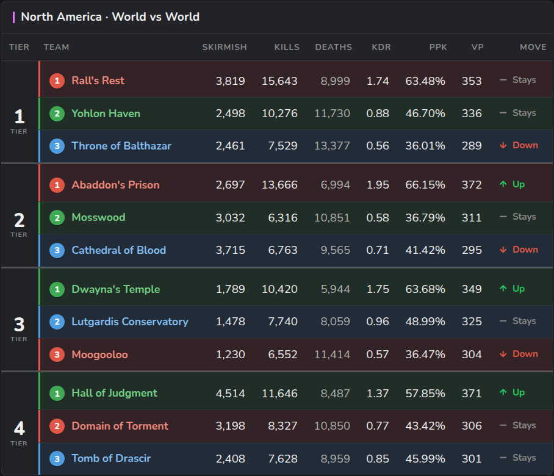
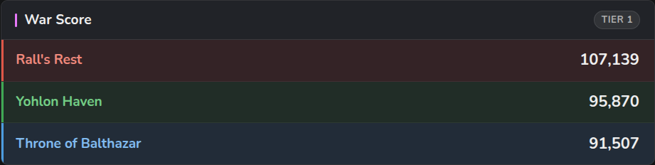
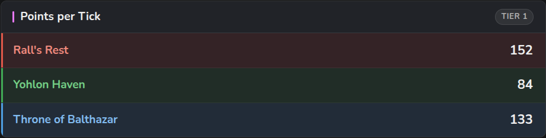
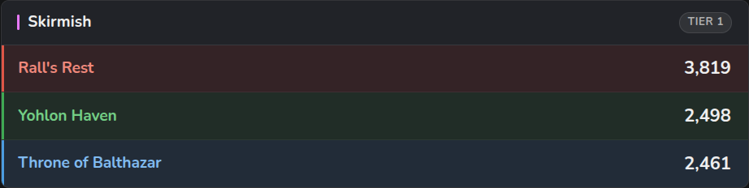
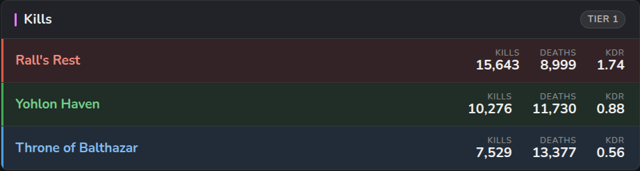
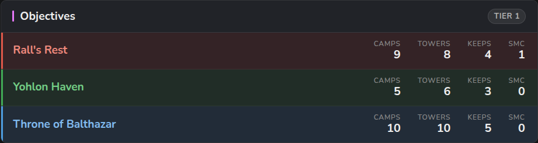

# WvW Tracking

WordPress plugin: GW2 World vs World matchup shortcodes.

## Screenshots

Region standings ladder (`[wvw_standings]`):

Match widgets — war score, points per tick, skirmish, kills, and objectives:

## Install
1. Copy this folder into `wp-content/plugins/`.
2. Activate **WvW Tracking** in Plugins.
3. Go to **Settings → WvW Tracking**: set your default team (world id),
   default region, refresh interval, and any friendly team-name mappings.

## Shortcodes
- `[wvw_score]` — three-way war score
- `[wvw_ppt]` — points per tick
- `[wvw_skirmish]` — current skirmish scores
- `[wvw_kills]` — kills, deaths, and KDR
- `[wvw_objectives]` — camps/towers/keeps/SMC counts
- `[wvw_standings region="na|eu"]` — full wvw.gg-style region ladder
  (Tier · Rank+Team · Skirmish · Kills · Deaths · KDR · PPK · VP · Move)

Note: `PPK` is computed as kill-efficiency `kills / (kills + deaths)` — the GW2
API exposes no PPK field; adjust `WVW_Data::ppk()` if you want a different formula.

Match-scoped shortcodes (`score`, `ppt`, `skirmish`, `kills`, `objectives`)
pick their match by, in order of precedence:

- `match="2-1"` — fixed match id (region digit + tier; `1`=NA, `2`=EU), or
- `region="na" tier="1"` — friendly equivalent of the match id, or
- `team="2001"` — auto-follow a team up/down the tiers, or
- the **default team** from settings when nothing is given.

## Team names (World Restructuring)

Each side is named by its **World Restructuring team id** (the `>= 11000` entry
in the API's `all_worlds`), not the legacy world id. ArenaNet publishes no name
for these team ids, so **NA (`11xxx`), EU (`12xxx`), and CN (`18xxx`)** team
names are built in — see `WVW_Names::wr_defaults()` (sourced from
[Drevarr/GW2-WVW-Teams](https://github.com/Drevarr/GW2-WVW-Teams)).

- Teams get renamed at relinks; to override a name, use the team-name map under
  **Settings → WvW Tracking** (keyed by team id) — it wins over the built-ins.
- Anything unmapped falls back to the legacy `/v2/worlds` name, then to
  `Team {id}`, so nothing renders blank.

## Development
- `composer install`
- `vendor/bin/phpunit` — runs the pure-logic unit tests (no WordPress needed).
